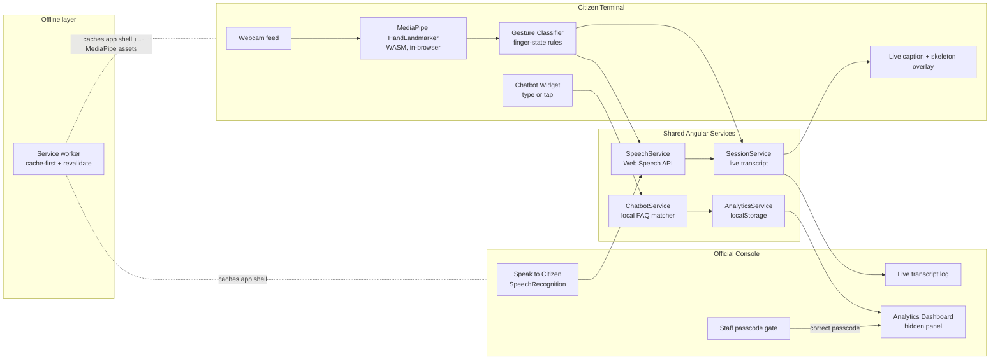

# SignBridge — Assistive Sign-Language-to-Speech Translator
### PS16 — Public Service Counter Prototype

SignBridge turns a citizen's hand signs into spoken words for a counter
official, and the official's spoken words into on-screen captions for
the citizen. It combines an Angular counter terminal, browser-based
MediaPipe tracking, an optional FastAPI landmark recognizer, a local
FAQ assistant, and a staff analytics view.

---

## 1. Problem understanding & scope

At a public service counter, a Deaf or hard-of-hearing citizen and a
hearing official usually have no shared language. Existing solutions
either need a live human interpreter (expensive, not always available)
or a phone app the citizen must own and know how to use. SignBridge is
designed to live on **the counter's own device** — a low-cost webcam
and screen the official already has — so the burden of adapting is on
the institution, not the citizen.

The prototype makes three scoping decisions on purpose, and states
them up front rather than hiding them:

1. **A small, isolated-sign vocabulary for reliable counter phrases.**
   Hand landmarks come from MediaPipe's `HandLandmarker`; the browser
   classifier uses stable finger geometry and a hold-to-confirm window.
   Extended mode adds a conservative backend recognizer and returns no
   word when the landmark pattern is ambiguous.
2. **Deterministic, on-device logic everywhere.** The FAQ assistant is
   a local keyword matcher, not an LLM call, so it works with zero
   connectivity and zero latency — appropriate for a counter that may
   have unreliable internet.
3. **A single split-screen device**, not two devices that must be
   paired. This removes a whole class of setup/connectivity failure
   modes during a live demo.

---

## 2. Architecture



**Data flow,:**

- **Sign → Speech:** the webcam feeds `HandLandmarker` (running fully
  client-side via WASM). Landmarks go through a finger-state rule
  classifier. A sign must be *held* for ~550 ms to fire, which filters
  out transient hand motion. A confirmed sign calls
  `SpeechService.speak()` (Web Speech `speechSynthesis`) and is pushed
  into the shared `SessionService` transcript.
- **Speech → Captions:** the official taps "Speak to Citizen", which
  starts `SpeechService.startListening()` (Web Speech
  `SpeechRecognition`). Finalised phrases are pushed into the same
  transcript and rendered as a caption card on the Citizen Terminal.
- **Chatbot:** a citizen who prefers not to sign can type or tap a
  quick-prompt chip. `ChatbotService` does local keyword scoring
  against a small FAQ table and keeps one turn of context (so "how
  long?" after "documents" still resolves).
- **Analytics:** every gesture, chat query, and session start/end is
  recorded to `localStorage` by `AnalyticsService`. The Official
  Console's "Staff panel" button asks for a passcode (`2026` in this
  demo) before revealing the dashboard — this is what makes it a
  *hidden* panel rather than a visible tab.
- **Offline PWA:** `sw.js` is a hand-written service worker (not the
  Angular-generated one) using a cache-first-with-revalidate strategy
  on every GET request, including the MediaPipe WASM runtime and
  model file. Once a citizen has used the terminal once with
  connectivity, the core translation loop keeps working if the
  counter's internet drops.

---

## 3. Tech stack

| Layer            | Choice                                             |
|-------------------|----------------------------------------------------|
| Frontend framework | Angular 17 (standalone components, no NgModules)  |
| Hand tracking      | `@mediapipe/tasks-vision` `HandLandmarker` (WASM, GPU delegate) |
| Sign → Speech      | Web Speech API — `speechSynthesis`                |
| Speech → Captions  | Web Speech API — `SpeechRecognition`              |
| Offline support    | Hand-written service worker + Web App Manifest    |
| Analytics storage  | `localStorage` (no backend needed for the demo)   |
| Styling            | Hand-written CSS with design tokens, glassmorphism, no UI kit |

### Sign-language profiles

The citizen terminal supports language profiles for **Indian Sign
Language (ISL), American Sign Language (ASL), British Sign Language
(BSL), Auslan, and French Sign Language (LSF)**. The profile controls
the active counter vocabulary label and speech-output locale. The
included geometric vocabulary is an isolated-sign counter vocabulary;
it is not a complete grammar or a claim of full linguistic coverage.

The optional backend accepts the same profile codes (`isl`, `asl`,
`bsl`, `auslan`, and `lsf`) and includes the selected code in each
prediction response. Full language-specific recognition requires a
trained landmark model and label map for that language.

---

## 4. Project structure

```
src/app/
  app.component.*              Split-screen shell
  models/gesture.model.ts       Shared TypeScript interfaces
  services/
    hand-tracking.service.ts    MediaPipe pipeline + gesture classifier
    speech.service.ts           speechSynthesis + SpeechRecognition
    chatbot.service.ts          Local FAQ matcher
    analytics.service.ts        Event logging + aggregation
    session.service.ts          Shared live transcript
  components/
    citizen-terminal/           Camera view, captions, vocabulary list
    official-console/           Transcript log, mic control, staff gate
    chatbot-widget/             Floating type/tap assistant
    analytics-dashboard/        Hidden staff metrics panel
```

---

## 5. Setup & run locally

**Requirements:** Node.js 18+ and npm. A webcam and microphone. Chrome
or Edge is recommended (best `SpeechRecognition` support).

```bash
npm install
npm start          # ng serve, opens on http://localhost:4200
```

1. Open the app and allow **camera** access on the Citizen Terminal
   side (click "Start camera").
2. Select a language profile, then hold one of the signs listed under
   "Signs this terminal understands" for about half a second.
3. On the Official Console, click **Speak to Citizen** and talk — your
   words appear as a caption on the Citizen Terminal.
4. Click **Staff panel** on the Official Console and enter passcode
   `2026` to reveal the Analytics Dashboard.
5. To test offline mode: load the app once with internet, then run
   `npm run build:prod`, serve the `dist/signbridge` folder, and
   disconnect the network — the shell and any already-loaded
   MediaPipe assets keep working.

To build for deployment:

```bash
npm run build:prod   # outputs to dist/signbridge
```

### Deploy frontend and backend to Vercel

The repository uses one Vercel project with two services: Angular is
served at `/` and FastAPI is exposed under `/api`.

1. Import the repository into Vercel.
2. Use the repository root as the project root. The frontend service
   builds with `npm run build:prod` into `dist/signbridge`; the backend
   service uses `backend/api/index.py` as its Python entrypoint.
3. Leave `src/assets/runtime-config.js` empty for the combined deployment.
   The browser automatically posts landmark windows to `/api/translate`,
   which Vercel routes to the backend service.
4. Set `SIGNBRIDGE_ALLOWED_ORIGINS` only when the backend is also called
   from another origin. Multiple origins can be separated with commas.

The Vercel backend uses HTTP because Vercel serverless functions do not
keep WebSocket connections alive. Local development and dedicated
WebSocket hosting continue to use `/ws/translate` automatically when the
runtime backend URL is configured with `ws://` or `wss://`.

---

## 5a. Optional: extended landmark pipeline

The Citizen Terminal has an "extended vocabulary" toggle that switches
to a second pipeline using MediaPipe pose and hand landmarks. It needs
the FastAPI backend running alongside the Angular app. Without a
trained checkpoint, the backend supports the explicit counter patterns
listed in `backend/model.py`; it does not claim to recognize all 2,000
WLASL classes.

**Run the backend:**

```bash
cd backend
python -m venv .venv
source .venv/bin/activate      # Windows: .venv\Scripts\activate
pip install -r requirements.txt
uvicorn main:app --reload --port 8000
```

By default this runs `StubGlossModel` — a zero-dependency landmark
heuristic for the explicit counter vocabulary. It returns `idle` for
missing hands, ambiguous patterns, and low-confidence motion; it does
not turn arbitrary movement into a random word. To use a real
Pose-TGCN checkpoint instead:

1. Install torch: `pip install torch`
2. Get the checkpoint + label map from the WLASL/Pose-TGCN authors'
   repo (research-use license — check its terms).
3. Make sure `PoseTGCNModel` in `backend/model.py` matches the
   checkpoint's layer names/shapes (or swap in their model class
   directly), and load their label map into `self.vocab`.
4. `export WLASL_CHECKPOINT=/path/to/checkpoint.pt` before starting
   uvicorn.

**Stability behaviour:** the backend locks onto the first accepted word
per signing episode and clears it when the recognizer reports idle.
The fallback requires a visible hand, enough episode motion, a known
finger pattern, and at least 64% pattern agreement across the window.
This makes false words less likely, but it remains a heuristic and
should be replaced with a trained, language-specific model for
production use.

**Data flow:** Angular runs MediaPipe's `PoseLandmarker` + `HandLandmarker`
locally (33 pose + 21+21 hand points), streams only those coordinates
— not video — over a WebSocket to `/ws/translate`, the backend buffers
a 45-frame sliding window per connection and runs inference every 8th
frame once the window is full, and sends `{gloss, confidence, language}`
back.

**Hardware optimization, concretely:**

| Where | What | Why |
|---|---|---|
| `WlaslKeypointService` | Capture capped to 12 fps via a timestamp gate in the detection loop | MediaPipe inference, not the network, is what burns CPU/battery — this is the main lever |
| `wlasl-translator.component.ts` | `getUserMedia` requests 480×360 instead of full camera resolution | Smaller frames mean less work per MediaPipe call |
| `KeypointStreamService.sendFrame()` | Drops a frame if the socket's `bufferedAmount` shows a previous one hasn't flushed | Prevents an ever-growing backlog under network/backend slowness — degrades to a lower effective rate instead of runaway latency |
| `main.py` | Sliding window (`deque(maxlen=45)`) + `STRIDE=8` | Buffering is cheap; inference is expensive — only run it periodically once there's enough temporal context |

---

## 6. Roadmap: from heuristic to trained recognition

The finger-state classifier in `hand-tracking.service.ts` is
intentionally isolated behind one method, `classify()`. To move from
the counter vocabulary to full language-specific recognition:

1. Collect landmark sequences per sign (e.g. using the [INCLUDE ISL
   dataset](https://zenodo.org/record/4010759) or a self-recorded set
   captured through this same `HandTrackingService.landmarks$` stream).
2. Train a separate classifier and label map per language (TensorFlow.js
   `LayersModel` on landmark sequences is enough for isolated signs; an
   LSTM/temporal model is more appropriate for continuous signing).
3. Replace the body of `classify()` with `model.predict(...)` — every
   other service (speech, session, analytics, chatbot) is unaffected,
   since they only depend on the `GestureDefinition` the classifier
   returns.

---

## 7. Judging rubric alignment

| Rubric area | How this prototype addresses it |
|---|---|
| Problem Understanding (20) | Scoping decisions stated explicitly (Section 1); accessibility-first font choice (Atkinson Hyperlegible); designed for the counter's device, not the citizen's |
| Code Quality (30) | Standalone Angular components, one responsibility per service, typed models, isolated/replaceable classifier, builds clean with `ng build --configuration production` |
| Live Usability (25) | Zero-latency in-browser inference, resilient error states (camera blocked, mic unsupported, model load failure), offline PWA fallback, works on a single device |
| Presentation (25) | Calm, distraction-free UI matched to a public-counter setting; hidden staff view keeps the citizen-facing screen simple |

---

## 8. 60-second live demo script

1. **(0:00–0:10) Open on the split screen.** "This is SignBridge — one
   screen, two views. Left is what the citizen sees, right is what the
   counter official sees."
2. **(0:10–0:25) Core translation.** Start the camera, show the "Help"
   sign held for a moment → it speaks aloud and appears in the
   official's transcript instantly. Show one more sign (e.g. "Thank
   you").
3. **(0:25–0:35) Reverse direction.** Tap "Speak to Citizen" and say a
   sentence — it appears as a caption on the citizen's screen.
4. **(0:35–0:45) Chatbot.** Tap "Prefer to type or tap instead?" on the
   citizen side, tap a quick prompt like "Where is the washroom?" —
   instant local answer, no network call.
5. **(0:45–0:55) Hidden analytics.** On the official side, tap "Staff
   panel", enter the passcode, reveal the dashboard — "the same signs
   and questions we just used are already showing up here, which is
   how a counter head would spot a recurring issue."
6. **(0:55–1:00) Close.** "It's a single Angular app, runs offline
   after first load, and the sign vocabulary is designed to be
   swapped for a trained model without touching anything else."

---

## 9. Known limitations (state these if asked)

- The included vocabulary is small and geometric, chosen for a live
   counter demo rather than full grammar in ISL, ASL, BSL, Auslan, or LSF.
- The backend fallback is a conservative heuristic. Production
   deployments should load a validated, language-specific checkpoint and
   label map rather than treating the fallback as a general translator.
- `SpeechRecognition` support varies by browser (best in Chrome/Edge;
  limited in Firefox/Safari) — this is a Web Speech API constraint,
  not something the app can work around.
- The hand-written service worker caches opportunistically; it is not
  a full offline-first precache manifest. `ng add @angular/pwa` is the
  documented upgrade path for production-grade precaching.
